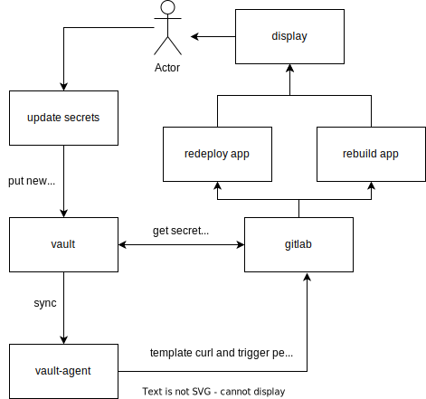

# Descriptions
This example how use vault agent in docker containers 
u can trigger any webhook or build image with tools 
# Diagram
this simple how to use vault agent for gitlab-ci  



# Start 
You need install nix-shell [link](https://nixos.org/download.html#download-nix) after run command<br>
### build and run docker containers 
```bash
docker-compose build && docker-compose up -d 
```
### Initialization vault policy and secrets 
```bash
vault-init-secret 
```
### Sync vault agent and vault server 
```bash 
vault-approle
```
### Update secrets 
```bash
vault kv put kv/secrets/static id=1 user=test1 password=sup4s3cr3t
```
### After 1 min u can look logs u new secrets  
```bash
docker logs -f test-webhookv
```